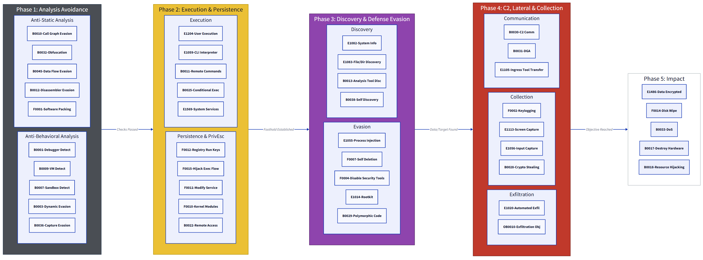

# 🛡️ MBC D2 Flow (`mbcd2flow`)

โปรเจกต์นี้ถูกสร้างขึ้นเพื่อใช้เป็นเครื่องมือในการ **สื่อสารและอธิบายทิศทางการทำงาน (Attack Path)** ของมัลแวร์ในรูปแบบ Visual Diagram โดยใช้ภาษา D2 

---

## 🎯 จุดประสงค์ของโปรเจกต์
* **Malware Analysis Support:** ใช้ประกอบการไล่โค้ด (Static Analysis) เพื่อคาดเดา **Control Flow** ว่ามัลแวร์น่าจะทำอะไรต่อหลังจากพฤติกรรมที่ตรวจพบ
* **Reverse Engineering Guide:** ช่วยให้ Analyst ไม่หลงทางเกินไป ขณะทำ Reversing โดยการ Match พฤติกรรมเข้ากับ MBC Objective
* **Incident Communication:** ใช้สื่อสารกับทีม IR/SOC ให้เห็นภาพตรงกันว่าภัยคุกคามอยู่ในระยะ (Stage) ไหน

## 🚀 ทำไมต้องใช้ D2?
> D2 อัพเดต flow ได้ง่าย ผมลองแล้วค่อนข้างถูกใจเลยใช้อันนี้น่ะ 
แต่อันที่จริง ส่วนหนึ่งก็คือ
เนื่องจาก D2 เป็น **Declarative Language** ทำให้เราสามารถแก้ไขโครงสร้างพฤติกรรมได้รวดเร็ว รองรับการทำ Automation ในอนาคต และที่สำคัญคือ **ผมถนัดครับ** 

---

## 📊 โครงสร้างการโจมตี (5 Phases)
เราแบ่งกลุ่มพฤติกรรมตามลำดับเหตุการณ์ (Chronological Order) เพื่อให้ง่ายต่อการวิเคราะห์:

| Phase | สถานะ | สี | คำอธิบาย |
| :--- | :--- | :--- | :--- |
| **Phase 1** | **Analysis Avoidance** | 🌑 เทา | การพรางตัว ตรวจสอบ Sandbox/VM/Debugger |
| **Phase 2** | **Execution & Presence** | 🟡 เหลือง | การเริ่มรันคำสั่ง และการฝังตัว (Persistence) |
| **Phase 3** | **Internal Operations** | 🟣 ม่วง | สำรวจระบบ ขโมยสิทธิ์ และหลบเลี่ยงการตรวจจับภายใน |
| **Phase 4** | **C2 & Data Theft** | 🔴 แดง | การติดต่อเครื่องแม่ (C2) และการขยายผล (Lateral) |
| **Phase 5** | **Final Impact** | ⚪ ขาว | การบรรลุเป้าหมาย (Ransomware, DoS, Destruction) |

---

## 🛠️ วิธีใช้งาน

1.  คัดลอกโค้ดจากไฟล์ [`mbc_flow.d2`](./mbc_flow.d2)
2.  นำไปวางใน [D2 Playground](https://play.d2lang.com/) หรือใช้งานผ่าน [D2 CLI](https://d2lang.com/tour/install)
3.  **[Future Plan]** เชื่อมต่อ Output จาก Sandbox (JSON) หรือ EDR Logs เข้ากับระบบ **Semi-automate** เพื่อวาดเส้นความสัมพันธ์ของเคสที่กำลังวิเคราะห์ได้ทันที

---

## 📂 โครงสร้างไฟล์ในโปรเจกต์

* `mbc_flow.d2`: ไฟล์หลักที่บรรจุโครงสร้าง Behavior ทั้งหมด (Core Logic)
* `assets/`: รูปภาพตัวอย่างของแผนภาพที่ Render แล้ว (สำหรับดูตัวอย่างไวๆ)

---

## 🤝 เพื่อนที่สนใจมีส่วนร่วม (Contribution)
หากคุณพบพฤติกรรมใหม่ๆ หรือต้องการเสนอไอเดียการ Mapping ให้แม่นยำขึ้น:
* 🍴 **Fork** โปรเจกต์นี้
* 🔧 สร้าง **Pull Request**
* 🐛 แจ้งปัญหาได้ที่ **Issues**: [https://github.com/runmalware/mbcd2flow](https://github.com/runmalware/mbcd2flow)
